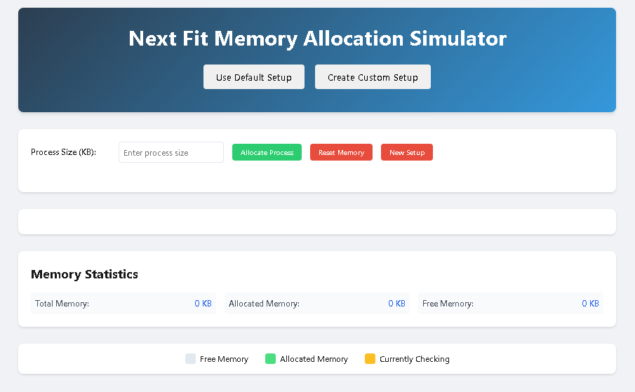

# Next Fit Memory Allocation Simulator

An interactive web-based simulator that demonstrates the Next Fit memory allocation algorithm. This educational tool helps users understand how memory is allocated in operating systems using the Next Fit strategy.

## Features

### Memory Configuration Options

1. **Default Setup**
   - Preconfigured memory layout with 1650 KB total memory
   - 9 memory blocks of varying sizes:
     - Block 1: 120 KB
     - Block 2: 250 KB
     - Block 3: 75 KB
     - Block 4: 400 KB
     - Block 5: 90 KB
     - Block 6: 200 KB
     - Block 7: 50 KB
     - Block 8: 315 KB
     - Block 9: 150 KB

2. **Custom Setup**
   - Define your own total memory size
   - Create custom-sized memory blocks
   - Add and remove blocks dynamically
   - Real-time remaining memory tracking

### Simulation Features

- **Next Fit Algorithm Implementation**
  - Starts searching from the last allocated position
  - Wraps around to the beginning when reaching the end
  - Visual indication of the search process

- **Real-time Visualization**
  - Color-coded memory blocks:
    - Gray: Free memory
    - Green: Allocated memory
    - Yellow: Currently checking
  - Dynamic block size representation
  - Free space indicators

- **Memory Statistics**
  - Total Memory Size
  - Allocated Memory
  - Free Memory
  - Block-wise allocation details

### Interactive Controls

- Process allocation with custom sizes
- Memory reset functionality
- Switch between default and custom configurations
- Real-time feedback messages
- Animated allocation process

## How to Use

1. **Starting the Simulator**
   - Open `index.html` in a modern web browser
   - Choose between "Default Setup" or "Create Custom Setup"

2. **Using Default Setup**
   - Click "Use Default Setup" to start with predefined memory blocks
   - Proceed directly to allocating processes

3. **Creating Custom Setup**
   - Click "Create Custom Setup"
   - Enter total memory size
   - Add memory blocks of desired sizes
   - Click "Start Simulation" when ready

4. **Allocating Memory**
   - Enter process size in KB
   - Click "Allocate Process"
   - Watch the allocation animation
   - Monitor success/failure messages

5. **Additional Controls**
   - "Reset Memory": Clears all allocations
   - "New Setup": Return to setup choice
   - Remove individual blocks in custom setup

## Technical Details

### Implementation
- Pure HTML, CSS, and JavaScript
- No external dependencies
- Responsive design
- Modular code structure

### Files
- `index.html`: Main application structure
- `styles.css`: Visual styling and animations
- `script.js`: Core logic and algorithms
- `README.md`: Documentation

### Browser Compatibility
- Chrome (recommended)
- Firefox
- Safari
- Edge

## Educational Value

This simulator helps students and developers understand:
- Memory allocation algorithms
- Next Fit strategy implementation
- Memory management concepts
- Real-time memory state visualization
- Process allocation patterns

## Development

### Local Setup
1. Clone the repository
2. Open `index.html` in a web browser
3. No build process or server required

### Customization
- Modify block sizes in `script.js`
- Adjust colors in `styles.css`
- Add new features to enhance learning

## License

This project is open source and available under the MIT License.

## Contributing

Contributions are welcome! Please feel free to submit a Pull Request.
